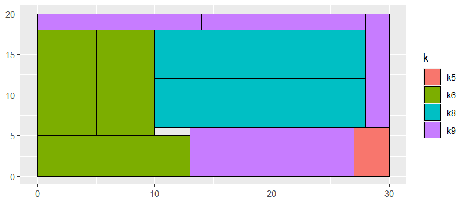

# 2d Knapsack problem

Fill a container with rectangles, maximizing the total value. We allow rotation.

Reference:
https://yetanothermathprogrammingconsultant.blogspot.com/2021/10/2d-knapsack-problem.html

We have three different models:

  - 2dknapsack.gms: covering model (requires integer widths/heights and locations)
  - 2dkapsack2.gms: continuous size model (fractional sizes and locations)
  - 2dknapsack.py: Or-Tools model based on NoOverlap2d constraint 
