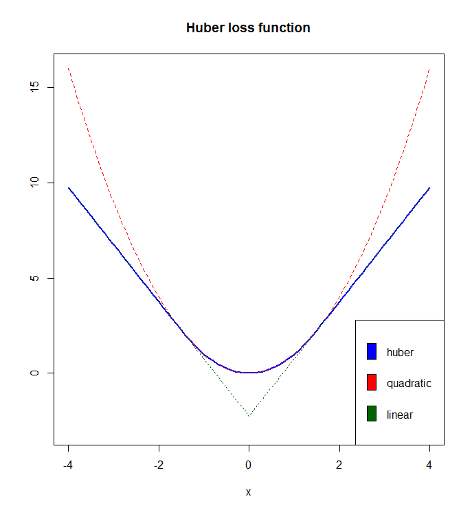

# Huber Regression

These are models related to 
https://yetanothermathprogrammingconsultant.blogspot.com/2021/09/huber-regression-different-formulations.html

The idea is that the Huber loss-function is less sensitive to outliers than the more traditional least-squares objective.

The models are:

  1. HuberNLP.gms: solve as NLP
  2. HuberLCP.gms: formulated as LCP model and solved as MCP
  3. HuberQP.gms: convex QP model
  4. HuberDualQP.gms: dual model, also a convex QP.

