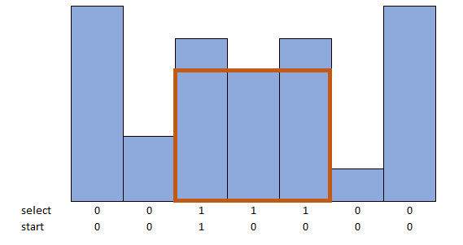

Different formulations for finding a maximum rectangular area under a histogram.

Reference:
https://yetanothermathprogrammingconsultant.blogspot.com/2020/08/largest-rectangular-area-in-histogram.html
