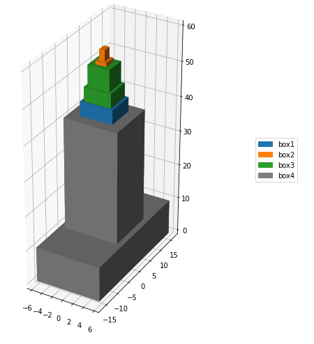

# Stacking 3d boxes

Stack 3b boxes such that the base of each layer is strictly shrinking.
Maximize the total height.

See:
https://yetanothermathprogrammingconsultant.blogspot.com/2021/10/stacking-3d-boxes-under-rotation.html

